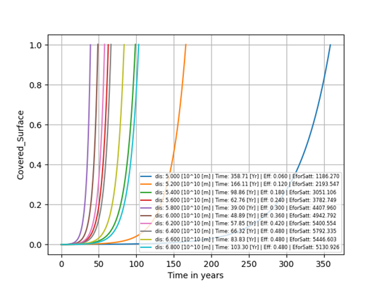

# COGROB HOMEWORK 2: The Dyson Swarm Adventure

## Introduction

This repository contains the documentation and code for COGROB Homework 2, titled "The Dyson Swarm Adventure." The assignment involves designing and simulating a Dyson Swarm Adventure to capture 90% of the sun's Irradiance by 2100. The main objective is to capture 90% of the sun's Irradiance by the year 2100. Due to limitations in solar panel efficiency, the aim is to maximize the amount of energy that can be obtained. The assignment requires gathering and analyzing relevant engineering data from the web to formulate the physical properties of this challenge and make informed predictions about its future potential.

## Preliminary Knowledge

It takes about 2,000kWh to create a 1,000-watt solar panel, which corresponds to 1 of the solar panels on earth.

According to NASA's MESSENGER spacecraft, which orbited Mercury from 2011 to 2015, it took approximately 6.5 years to complete its journey from launch to orbit insertion at Mercury.

The maximal theoretical efficacy of solar panels is 68.7%. Based on the mentioned, the efficacy we will reach in the nearest future will be 30% in Mercury orbit.

## Formulas and Equations

Satellite energy efficiency with respect to distance:

eeff(dorbit2sun) = e𝑠 / (dorbit2sun − 𝑑𝑚𝑒𝑟2𝑠𝑢𝑛) + 𝑒𝑠

The surface area required to capture the sun’s power output:

𝑆𝑜𝑟𝑏𝑖𝑡 = 0.9 ⋅ 4π(dorbit2sun)2

The energy that falls on each satellite with respect to the distance from the sun:

Isolar−panel(dorbit2sun) = Isolar / 4π(dorbit2sun)2

The total energy received from all the satellites:

Etotal(dorbit2sun) = eeff(r) ⋅ Nsat ⋅ Ss ⋅ Isolar / 4π(dorbit2sun)2

## Numerical Assumptions

According to the solar panel’s maximal theoretical efficacy, it is estimated that the efficacy in the nearest future will reach 30% in Mercury orbit.

Based on the amount of energy required to create solar panels, it is estimated that it will be 20 times ‘cheaper’ in energy terms to produce satellites on Mercury.

It is assumed that the travel time in space will be shorter in the future and velocities of rockets will be 10 times faster in 10 years.

## Implementation

To achieve the goal, it is assumed that once an autonomous crew is deployed on Mercury and an initial number of energy-harvesting satellites are in orbit, the actions would be stable and the growth rate would be predictable and exponential. Using this assumption, PDDL is used to plan the initial stage of the mission, and once stability is reached, a Python script is used to predict growth and energy absorption.

## Results and Conclusions

Results show challenges in solving the PDDL part, but the Python script approximates energy intake over time. Conclusions highlight the complexity of the mission and the use of simplifications and relaxed assumptions to construct a simple model. The chosen method to solve this problem was with PDDL with another python script to approximate growth rate of the mission and, once stability is reached, a Python script to predict growth and energy absorption.

The covered surface of the sun in percentage through time in years with different distances of orbits from the sun. the distance is represented in 10^10 [m], the Time in years, Eff it the efficiency of each satellite in a specific orbit, and EforSatt is the energy absorbed in [Watt-month]

This README provides an overview of the assignment, including the objectives, preliminary knowledge, formulas and equations, numerical assumptions, implementation plan, and conclusions.
